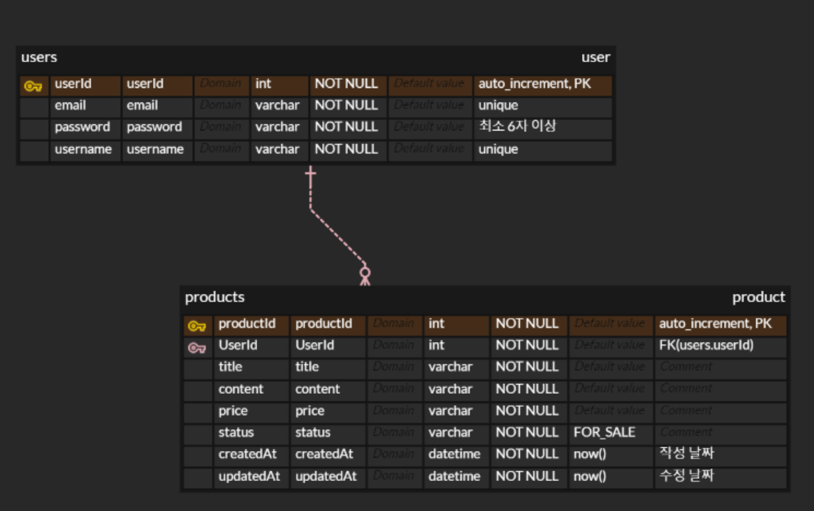

# node_server_project
- [프로젝트 링크](http://13.125.216.232:3000/api/products)

## 프로젝트 개요

1.  **API 명세서 작성**

-   [API 명세서 링크](https://roasted-crush-68f.notion.site/API-c4670adf7f7445d0971d75a227b31946?pvs=4)

<br  />

2.  **MySQL과 Prisma 이용한 데이터베이스 설계**

-   ERD 작성 및 Prisma 사용한 마이그레이션 코드와 스키마 코드 작성

-   [ERD 명세서](https://www.erdcloud.com/d/WKRMdGWujQa8r5Q4X)

<br  />



<br  />

3.  **인증 관련 기능 구현**

-   JWT(액세스 토큰) 이해

-   회원가입, 로그인, 내 정보 조회 API 구현

-   JWT를 활용한 인증 Middleware 구현

-   상품 관련 기능에 인증 로직 추가

<br  />

4.  **기술 스택**

    

    

    

    

    

    

    

    

<br  />

<br  />

5.  **3계층 아키텍처 프로젝트 구조**

    ```bash

        📦api-docs
         ┣ 📜auth.http
         ┣ 📜products.http
         ┗ 📜users.http

        📦prisma
         ┗ 📜schema.prisma
    
        📦src
         ┣ 📂config
         ┃ ┗ 📜config.js
         ┣ 📂controllers
         ┃ ┣ 📜auth.controller.js
         ┃ ┣ 📜products.controller.js
         ┃ ┗ 📜users.controller.js
         ┣ 📂lib
         ┃ ┣ 📜error-lists.js
         ┃ ┗ 📜schema-validation.js
         ┣ 📂middlewares
         ┃ ┣ 📜auth-middleware.js
         ┃ ┗ 📜error-middleware.js
         ┣ 📂repositories
         ┃ ┣ 📜auth.repository.js
         ┃ ┣ 📜products.repository.js
         ┃ ┗ 📜users.repository.js
         ┣ 📂routers
         ┃ ┣ 📜auth.router.js
         ┃ ┣ 📜index.js
         ┃ ┣ 📜products.router.js
         ┃ ┗ 📜users.router.js
         ┣ 📂services
         ┃ ┣ 📜auth.service.js
         ┃ ┣ 📜products.service.js
         ┃ ┗ 📜users.service.js
         ┣ 📂utils
         ┃ ┗ 📂prisma
         ┃ ┃ ┗ 📜index.js
         ┗ 📜app.js

    ```

## 요구사항

1.  **프로젝트 기본 세팅 준비**

-   `.env` 파일을 이용하여 민감한 정보 관리

    ```bash
    DATABASE_URL
    
    MYSQL_USERNAME

    MYSQL_PASSWORD

    MYSQL_DATABASE

    MYSQL_HOST

    TOKEN_KEY
    ```

-   `.gitignore` 파일로 불필요한 정보 Github에 올라가지 않도록 설정

-   `.prettierrc` 파일 생성하여 코드 형태 유지

<br  />

2.  **API 명세서 작성**

-   API 명세서 템플릿을 Google Drive에 복제

-   과제 요구사항에 맞게 작성 후, README.md 파일에 명세서 URL 추가

<br  />

3.  **인증 관련 기능 개발**

-   회원가입 API

-   로그인 API

-   내 정보 조회 API

-   인증 Middleware 구현

<br  />

4.  **사용자 관련 기능 추가**

-   내 정보 조회 API 구현

<br  />

5.  **상품 관련 기능 추가**

-   상품 생성 API

-   상품 수정 API

-   상품 삭제 API

-   상품 목록 조회 API

-   상품 상세 조회 API

<br  />

6.  **API 호출 도구로 동작 확인**

-   Thunder Client, Rest Client 등을 사용하여 API가 정상적으로 동작하는지 확인

<br  />

7.  **배포**

-   AWS EC2 인스턴스에 프로젝트 배포

-   PM2를 사용하여 Express 서버가 예상치 않게 종료되어도 다시 실행되도록 설정

<br  />

<br  />

## 설치 및 실행

```bash

# 프로젝트 클론

git  clone  https://github.com/choisooyoung-dev/node_server_project_develop.git

```

```bash

# 의존성 설치

yarn  install

```

```bash

# 프로젝트 실행

yarn  dev

```

# 📢 더 고민해 보기

## 1. Class와 Instance가 각각 무엇인지 설명해 주세요.
- Class: 객체를 만들기 위한 템플릿 (명세서)
- Instance: 클래스를 기반으로 생성된 객체, 클래스의 속성과 메서드를 상속받는다.

## 2. Class의 Method는 화살표 함수(Arrow Function) 형태로 구현하지 않았을 때 발생할 수 있는 문제와 해당 문제를 해결할 수 있는 다른 방법을 적어주세요. (**Hint**: `this bind`)
- this 바인딩 문제가 발생한다. -> 자신만의 this를 생성하는 것이 아니라 외부 스코프의 this를 가져온다.
- bind 메서드를 사용하여 함수에 원하는 this값을 명시적으로 할당해준다.

## 3. 3-Layered Architecture의 장점과 단점을 아는대로 적어주세요.
- 장점: 모듈화, 유지보수 용이, 재사용성, 확장성, 테스트 용이
- 단점: 설계하는 시간이 오래걸린다, 작은 규모의 애플리케이션에서는 복잡성이 증가한다.

## 4. 숙련주차 과제에서 Mongoose를 Sequelize로 교체 했을 때와 비교하여 이번 과제에서 Sequelize를 Prisma로 교체하는 작업은 더 쉬웠나요? 더 어려웠나요? 왜 그런지 3-Layered Architecture를 기반으로 설명해 주세요.
- Prisma로 교체하는 것이 더 쉬웠습니다.
- schema 파일 자체가 알아보기 훨씬 쉬웠으며, repository 파일에서 관리했을때 한 곳에서 db 관련 코드를 한번에 볼 수 있었으며 시퀄라이즈보다 프리즈마 문법이 더 가독성이 좋았습니다. 그리고 각 라우터 마다 프리즈마를 import 해줬어야 했는데 3-Layered Architecture 구조로 나눈 후 필요한 파일에서만 import하여 썼기 때문에 더 간편했습니다.

## 5. 테스트코드 작성의 장점과 단점을 아는대로 적어주세요.
- 장점: 프로그램의 동작을 검증하는 작업이므로 버그를 미리 찾아내고 수정할 수 있다, 코드의 동작 예시를 미리 제공하는 것이므로 코드의 의도를 명확하게 파악할 수 있습니다.(문서화 역할)
- 단점: 추가적인 개발시간이 소요되며, 유지보수 비용이 증가합니다

## 6. 테스트의 종류 3가지와 각각이 무엇인지 간단히 설명해 주세요.
1) 단위 테스트: 모듈, 함수, 클래스 등 최소 단위의 코드를 테스트 하는 것 -> 코드가 의도한 대로 동작하는 지 검증, 성공 시 대부분 정상 동작할 것으로 기대된다.
2) 통합 테스트: 단위 테스트가 통과한 모듈들을 결합하여 전체 시스템이 의도한 대로 동작하는 지 확인하는 것 -> 실제 운영 환경과 유사하게 수행된다.
3) 인수 테스트: 최종 사용자인 클라이언트의 요구사항을 만족하는 지 확인하는 것, 전체 시스템의 완전한 기능을 테스트한다. -> 사용자 시나리오 기반 테스트 케이스를 작성하며 요구사항 충족하는 지 확인한다. 

